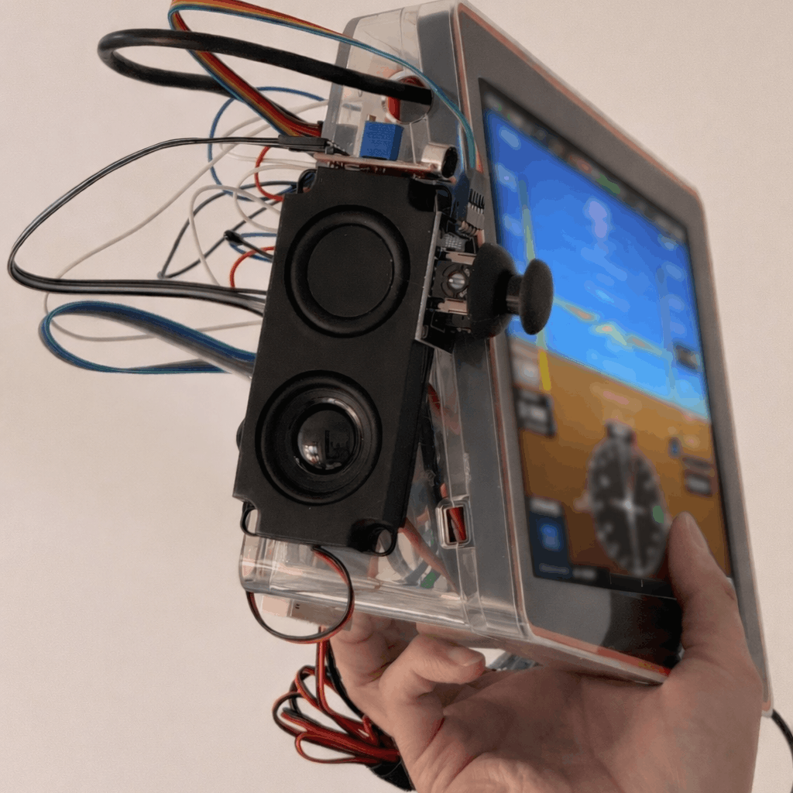

# ORCH AVIONICS®

---

## ✈️ Introducing Orch Avionic 1 EFB

### Your Predictive* Copilot in GA Flying  
### Votre copilote prédictif* en aviation générale

ADS-B, GPS, Handheld Radio, Fuel Calculation and Jeppesen* Charts.  
**All in one form factor.**

Predictive synthetic vision uses on-device AI to anticipate next steps in ADS-B traffic—especially at busy airports—so you stay ahead of the pattern.

Large vision and language models run locally.  
**No internet connection required***.

---

# 🛩️ Orch Avionic 1 (Demo Prototype)

> Above image is our Mark 1 pathfinder model.  
> Final product may differ in shape or form.

**Sales expected to begin in November 2026.**

---

## 📍 Locations

### Montreal HQ  
1010 Rue Sainte-Catherine Ouest  
Suite 200  
Montreal, QC H3B 5L1  
Canada  

### Irvine Office  
2211 Michelson Dr  
Suite 900  
Irvine, CA 92612  
United States  

---

## 📩 Inquiries

Contact us for partnerships, early access, and investment opportunities.

---

## ⚠️ Disclaimers

- *Downloading and updating NAV data requires Wi-Fi or Starlink connection.*  
- *Starlink is a trademark/property of SpaceX. Orchestr Aerospace Inc. is not affiliated with and does not own Starlink or SpaceX.*  
- *Not affiliated with Jeppesen yet.*
